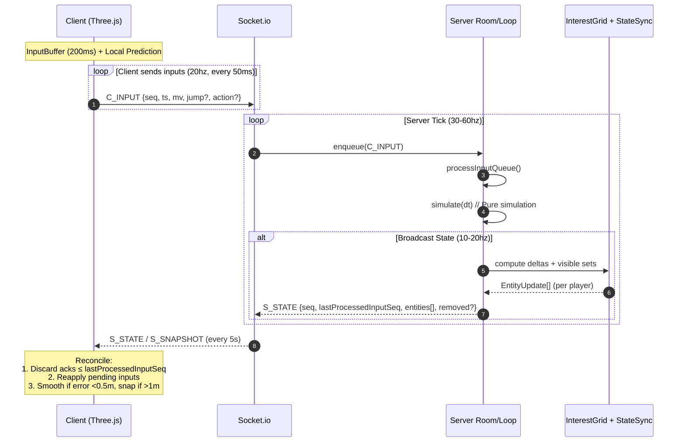
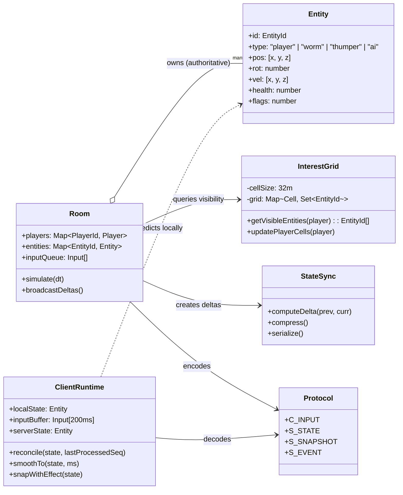
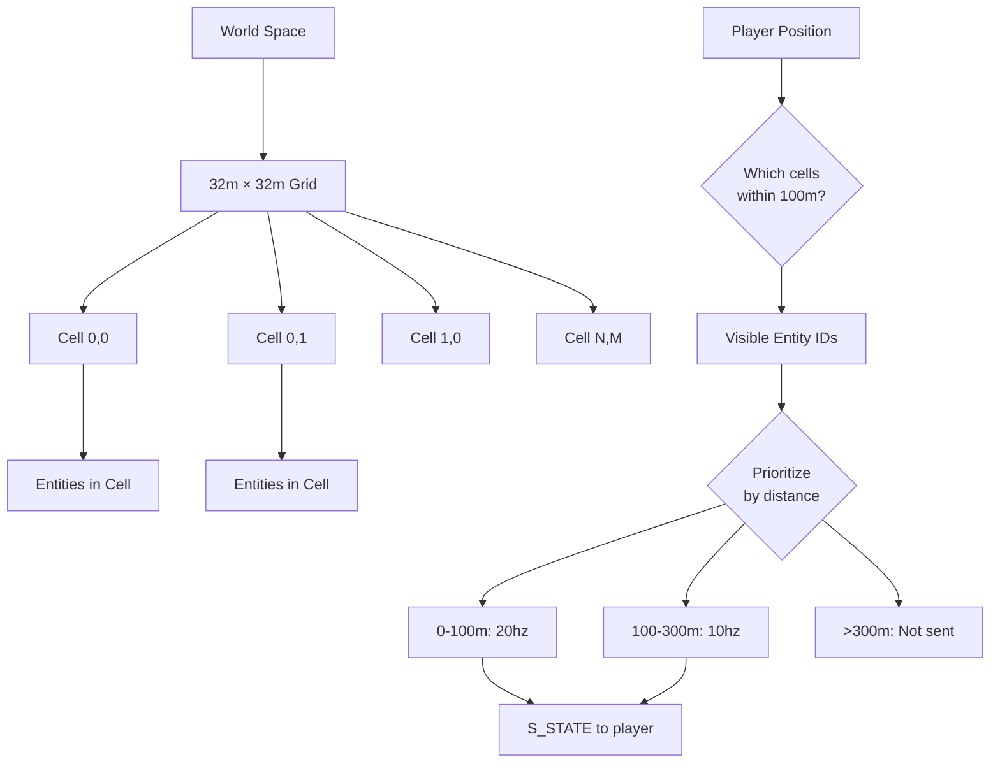

# System Diagrams

Visual reference for understanding the Fremen game architecture, data flow, and timing.

## A) Client ↔ Server Data Flow (Prediction/Reconciliation)

This sequence shows how client inputs are predicted locally, sent to the server, processed in the authoritative simulation, and reconciled back to the client.

**Key files**: `apps/client/src/networking/reconciliation.ts`, `apps/server/src/game/loop.ts`



---

## B) Timing: Server Tick vs Broadcast vs Client Render

Visual representation of how server simulation ticks (30hz), state broadcasts (10-20hz), and client rendering (60fps) interleave over 200ms.

**Key files**: `apps/server/src/game/loop.ts`, `apps/client/src/core/Renderer.ts`

```mermaid
gantt
    dateFormat  X
    axisFormat  %L ms
    title Client/Server Timing Window (0-200ms)

    section Server (30hz)
    Tick #1 (33ms)      :active, 0,   33
    Tick #2 (33ms)      :active, 33,  33
    Tick #3 (33ms)      :active, 66,  33
    Broadcast @ 100ms   :milestone, 100, 1
    Tick #4 (33ms)      :active, 99,  33
    Tick #5 (33ms)      :active, 132, 33
    Tick #6 (33ms)      :active, 165, 33
    Broadcast @ 200ms   :milestone, 200, 1

    section Client Input (20hz)
    Send @ 50ms         :milestone, 50, 1
    Send @ 100ms        :milestone, 100, 1
    Send @ 150ms        :milestone, 150, 1
    Send @ 200ms        :milestone, 200, 1

    section Client Render (60fps)
    Frame 1             :crit, 0, 16
    Frame 2             :crit, 16, 16
    Frame 3             :crit, 32, 16
    Frame 4             :crit, 48, 16
    Frame 5             :crit, 64, 16
    Frame 6             :crit, 80, 16
    Frame 7             :crit, 96, 16
    Frame 8             :crit, 112, 16
    Frame 9             :crit, 128, 16
    Frame 10            :crit, 144, 16
    Frame 11            :crit, 160, 16
    Frame 12            :crit, 176, 16
```



**Observations**:
- Server ticks 6 times in 200ms (30hz)
- Client renders 12 frames in 200ms (60fps)
- State broadcast occurs every 100ms (10hz) - subset of ticks
- Client sends inputs every 50ms (20hz)
- Client prediction fills gaps between server updates

---

## C) State Management & Ownership

Shows the relationship between server-authoritative state, interest management, client prediction buffers, and the shared protocol.

**Key files**: `apps/server/src/game/room.ts`, `apps/server/src/game/interest.ts`, `apps/client/src/networking/NetworkManager.ts`



**Authority Model**:
- **Server**: Owns all entity state, sole source of truth
- **Client**: Predicts own player, interpolates others
- **Interest Grid**: Filters which entities each client receives
- **Protocol**: Bridges client/server with typed messages

---

## D) Monorepo Package Architecture

Shows how the client and server apps depend on shared packages for protocol, types, and configuration.

**Key files**: Root `pnpm-workspace.yaml`, `package.json` files in each workspace

```mermaid
flowchart TB
    subgraph Apps
        direction TB
        subgraph Client["@fremen/client (Vite + Three.js)"]
            CCore[core/ - Renderer, Camera, Input]
            CNet[networking/ - NetworkManager, Reconciliation]
            CPhys[physics/ - Client prediction]
            CUI[ui/ - HUD, Menus]
            CEntities[entities/ - Player, Worm visuals]
        end
        
        subgraph Server["@fremen/server (Node.js + Socket.io)"]
            SLoop[game/loop.ts - Fixed tick loop]
            SRoom[game/room.ts - Room/session mgmt]
            SSim[game/sim/ - Pure simulation systems]
            SInterest[game/interest.ts - Grid filtering]
            SState[networking/stateSync.ts - Delta compression]
            SNet[networking/socketServer.ts - Socket.io setup]
            SAuth[auth/ - JWT generation/validation]
            SDB[db/ - DrizzleORM schema/queries]
            SBots[bots/ - Bot AI and backfill]
        end
    end

    subgraph Packages
        Protocol["@fremen/protocol<br/>messages.ts, encoder.ts, validator.ts"]
        Shared["@fremen/shared<br/>types, constants, utils"]
        Config["@fremen/config<br/>tsconfig, eslint"]
    end

    CNet --> Protocol
    CCore --> Shared
    CPhys --> Shared
    SLoop --> Protocol
    SSim --> Shared
    SInterest --> Shared
    SState --> Protocol
    SDB --> Shared
    SBots --> Shared
    Client -.-> Config
    Server -.-> Config

    style Protocol fill:#1A3A6E,color:#fff
    style Shared fill:#1A3A6E,color:#fff
    style Config fill:#666,color:#fff
```



**Package Responsibilities**:
- **@fremen/protocol**: Single source of truth for network messages (C_*, S_*)
- **@fremen/shared**: Position, Rotation, EntityId types, game constants
- **@fremen/config**: Shared TypeScript/ESLint configs

---

## E) Network Protocol Message Types

Schema overview of all client-to-server and server-to-client messages, with reconciliation relationship highlighted.

**Key files**: `packages/protocol/src/messages.ts`

```mermaid
classDiagram
    direction TB

    class C_INPUT {
        t: "input"
        seq: uint16
        ts: number
        mv: [x, z]
        jump?: 0 | 1
        look?: [yaw, pitch]
        action?: {type, target?}
    }

    class C_CHAT {
        t: "chat"
        channel: "global" | "team" | "proximity"
        message: string
    }

    class C_PING {
        t: "ping"
        position: [x, y, z]
    }

    class C_REQUEST_MATCH {
        t: "request_match"
        mode: "quickplay" | "custom"
    }

    class S_WELCOME {
        playerId: string
        serverTime: number
        roomId: string
        players: Player[]
        entities: Entity[]
    }

    class S_STATE {
        t: "state"
        seq: uint16
        ts: number
        lastProcessedInputSeq: uint16
        entities: EntityUpdate[]
        removed?: EntityId[]
    }

    class S_SNAPSHOT {
        t: "snapshot"
        seq: uint16
        ts: number
        roomId: string
        entities: Entity[]
    }

    class S_EVENT {
        t: "event"
        eventType: "damage" | "death" | "harvest" | "mount"
        sourceId?: EntityId
        targetId?: EntityId
        position?: [x, y, z]
        data?: object
    }

    class S_CHAT {
        t: "chat"
        senderId: string
        senderName: string
        channel: string
        message: string
    }

    C_INPUT ..> S_STATE : reconciled via<br/>lastProcessedInputSeq
    S_SNAPSHOT : full state every 5s
    S_STATE : delta updates 10-20hz
```

**Message Flow**:
1. **C_INPUT** → Server processes → **S_STATE** (with acknowledgment via `lastProcessedInputSeq`)
2. Client uses `lastProcessedInputSeq` to discard old inputs and reconcile predicted state
3. **S_SNAPSHOT** sent every 5s to prevent drift (full entity list)
4. **S_EVENT** for one-time events (damage, collection, etc.)

---

## F) Interest Management Grid

How the server partitions the world into cells and filters entity updates per player visibility.

**Key files**: `apps/server/src/game/interest.ts`



**Update Frequencies**:
- **High Priority** (0-100m): Every server tick (30-60hz) → broadcast subset (20hz)
- **Medium Priority** (100-300m): Every 3rd tick (~10hz)
- **Low Priority** (>300m): Not sent (out of interest range)

---

## Diagram Maintenance

**When to update these diagrams**:
- [ ] Changes to network message schemas → Update Diagram E
- [ ] Changes to tick rates or timing → Update Diagram B
- [ ] New packages added to monorepo → Update Diagram D
- [ ] Major refactor to prediction/reconciliation → Update Diagram A
- [ ] Changes to interest management logic → Update Diagram F

**Link diagrams to code**: Add comments in source files referencing relevant diagrams.

Example:
```typescript
// apps/server/src/game/loop.ts
// See docs/05-diagrams.md - Diagram B for timing visualization
const TICK_MS = 33; // 30hz
```
